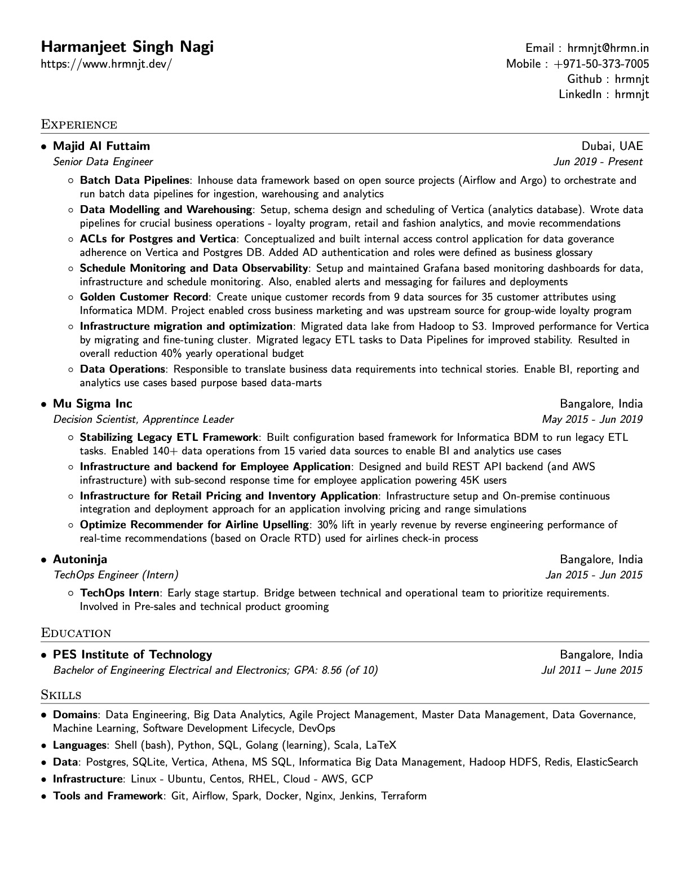

# LaTeX based Resumé

A simple one-column resume made in LaTex with Sans Serif font family.

## Motivation

[Link to post I wrote](https://www.hrmnjt.dev/p/resume-as-code)

I've dreaded the concept of resume in the past as it seems borderline (strong
word:) narcissistic. You need to go in lengths to explain all you have
ever worked on. I take pride in what I’ve worked on but don’t like the fact
that I need to explain it to my employer. I wonder if there were better ways to
exhibit this; easier if there was more open source culture.

Nevertheless, In order to make resume fun for me, and to check one of the
items in my list, I decided to make my resume using LaTeX (pronounced: LAH-tek)

### Why Latex?

In past, I'd wonder why all journals and papers published always followed
similar pattern and I thought to myself that it would be a criteria to write
the journal/paper in that particular format. Researching deeper, I realized
the reason it all looks similar was because in academics, people use a
different word processing engine - one which came with its own set of
awesome features.

- Macros and microtype
- Programmatic approach on visual formatting
- Pixel perfect typography for mathematics (haven't used it yet, but excited)
- Huge community (mostly academics, nerds and geeks)

But the most understated reason that I felt was codifying the **document and
version controlling**. Publishing documents as Git repositories seem like the
most natural approach for editing and improving them over time.

## Usage

Building the image (one time)

```bash
docker build -t latex .
```

Creating the PDF output
```bash
docker run --rm -i -v "$PWD":/data latex pdflatex hrmnjt-resume.tex
```

## Preview



# License

Format is Apache Licensed. Data is owned by Harmanjeet Singh Nagi. Completely.

```
Copyright 2020 Harmanjeet Singh Nagi

Licensed under the Apache License, Version 2.0 (the "License");
you may not use this file except in compliance with the License.
You may obtain a copy of the License at

    http://www.apache.org/licenses/LICENSE-2.0

Unless required by applicable law or agreed to in writing, software
distributed under the License is distributed on an "AS IS" BASIS,
WITHOUT WARRANTIES OR CONDITIONS OF ANY KIND, either express or implied.
See the License for the specific language governing permissions and
limitations under the License.
```
